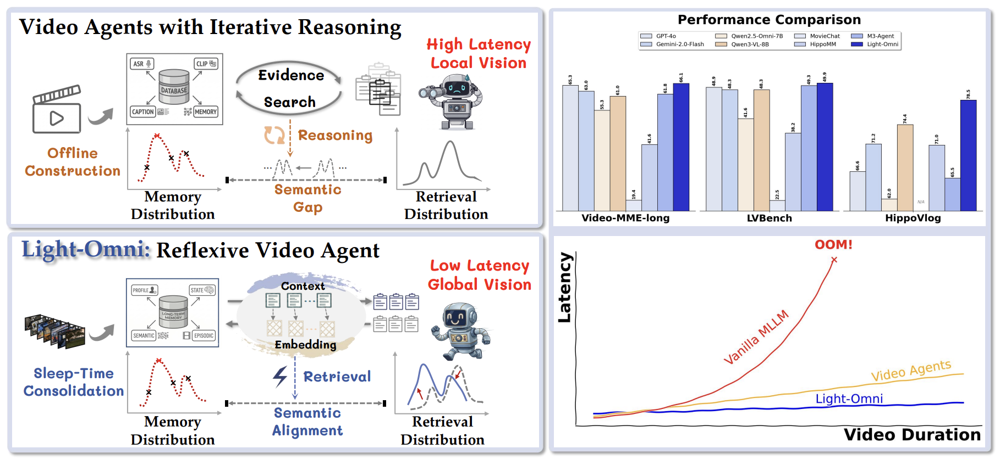
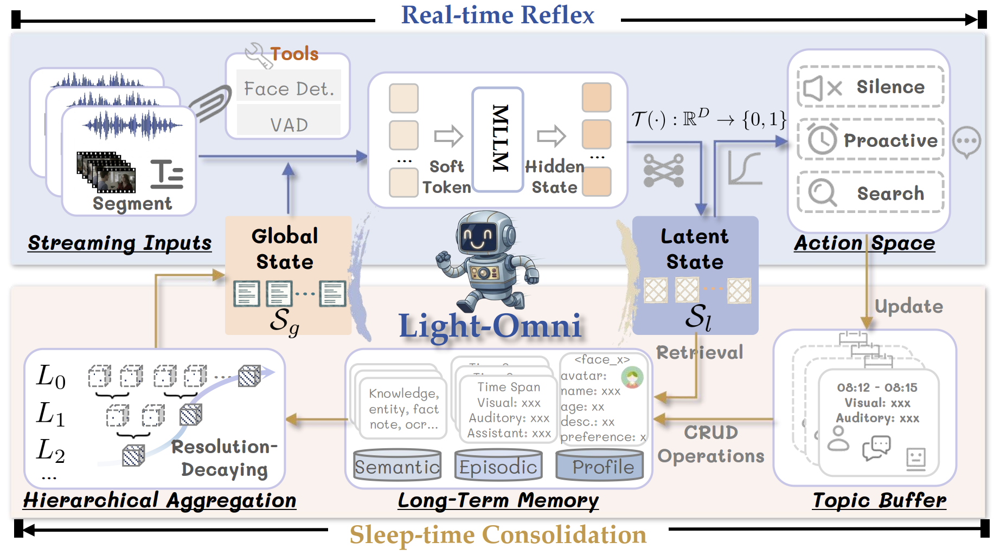
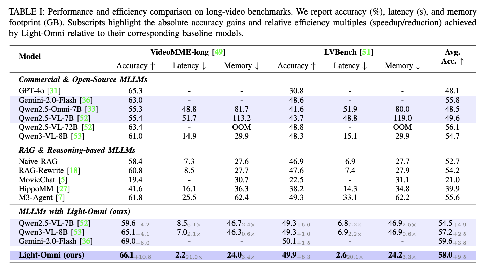

<h1 align="center">
  
  Light-Omni
</h1>

**Light-Omni: Reflex over Reasoning in Agentic Video Understanding with Long-Term Memory**

[](https://clare-nie.github.io/Light-Omni/)
[](https://huggingface.co/ClareNie/Light-Omni)
[](https://huggingface.co/datasets/ClareNie/Light-Omni-Training)
[](https://arxiv.org/abs/xxxx.xxxx)

Light-Omni is an agentic video understanding system with long-term multimodal memory. It is built on Qwen2.5-Omni and replaces costly iterative reasoning with a lightweight reflex-style pathway for deciding when to respond, when to retrieve memory, and how to ground the response in long-term multimodal context.

## News

- The Light-Omni model checkpoint is available on Hugging Face.
- The training data are released with standardized JSON annotations and compressed media archives.
- This repository vendors the patched `transformers` and `ms-swift` code required for Light-Omni training and inference.

## Contents

- [Introduction](#introduction)
- [Environment and Training](#environment-and-training)
- [Evaluation and Test Results](#evaluation-and-test-results)
- [Demo](#demo)
- [Performance](#performance)
- [Citation](#citation)

## Introduction

Light-Omni targets long-video interactive agents that need to maintain user-specific memory across visual, audio, and text streams. Instead of repeatedly invoking long reasoning loops, Light-Omni learns compact latent states for three operations:

<p align="center">
  
</p>

- **Generation Adapter**: decides and generates direct responses from current multimodal context.
- **Memory Adapter**: converts interaction history into long-term semantic and episodic memory.
- **Reaction Adapter**: predicts response/retrieval behavior and produces retrieval embeddings for memory lookup.

<p align="center">
  
</p>

The repository contains:

```text
.
├── docs/                 # GitHub Pages project homepage
├── logs/                 # Evaluation result JSON files
├── scripts/              # Light-Omni agent, prompts, model wrapper, memory tools
├── thirdparty/           # Patched transformers and ms-swift dependencies
├── web_demo/             # Flask/Socket.IO interactive demo
├── eval.py               # Long-video benchmark evaluation
├── requirements.txt      # Python dependencies
└── README.md
```

Main resources:

- Project page: https://clare-nie.github.io/Light-Omni/
- Code: https://github.com/Clare-Nie/Light-Omni
- Model: https://huggingface.co/ClareNie/Light-Omni
- Training data: https://huggingface.co/datasets/ClareNie/Light-Omni-Training
- Paper: https://arxiv.org/abs/xxxx.xxxx

## Environment and Training

Create a fresh conda environment for Light-Omni:

```bash
conda create -n lightomni python=3.11 -y
conda activate lightomni
git clone https://github.com/Clare-Nie/Light-Omni.git
cd Light-Omni
pip install -r requirements.txt
```

`requirements.txt` installs the patched dependencies in editable mode:

```text
-e ./thirdparty/transformers
-e ./thirdparty/ms-swift
```

Do not replace these two packages with vanilla upstream versions. Light-Omni depends on local changes in:

```text
thirdparty/transformers/src/transformers/models/qwen2_5_omni/modeling_qwen2_5_omni.py
thirdparty/ms-swift/swift/llm/template/template/qwen.py
thirdparty/ms-swift/swift/llm/train/sft.py
```

Training data are available at:

```text
https://huggingface.co/datasets/ClareNie/Light-Omni-Training
```

The dataset contains:

```text
memory_adapter.json
generation_adapter.json
reaction_adapter.json
media_archives/media.tar.zst.part-*
```

Restore media files after downloading the dataset:

```bash
cat media_archives/media.tar.zst.part-* | tar --zstd -xf -
```

Light-Omni is trained in three stages with the patched `ms-swift` scripts:

```bash
cd thirdparty/ms-swift

# Stage 1: train the generation adapter
CUDA_VISIBLE_DEVICES=0,1,2,3,4,5,6,7 sh scripts/sft_response.sh

# Stage 2: train the memory adapter
CUDA_VISIBLE_DEVICES=0,1,2,3,4,5,6,7 sh scripts/sft_memory.sh

# Stage 3: train the reaction/retrieval adapter
CUDA_VISIBLE_DEVICES=0,1,2,3,4,5,6,7 sh scripts/sft_retrieve.sh
```

Before running, update the placeholder paths in the scripts:

- `response_adapter_checkpoint_directory`
- `memory_adapter_checkpoint_directory`
- local Qwen2.5-Omni base model path
- local dataset JSON paths

The released checkpoint is available at:

```text
https://huggingface.co/ClareNie/Light-Omni
```

## Evaluation and Test Results

Run evaluation with:

```bash
conda activate lightomni
cd Light-Omni
CUDA_VISIBLE_DEVICES=0,1,2,3,4,5,6,7 python eval.py
```

`eval.py` includes loaders for:

- MME-Video Long
- LVBench
- HippoVlog

Update dataset paths near the bottom of `eval.py` before running on a new machine.

The scored result files are stored in `logs/`:

```text
logs/mmevideolong_results_scored.json
logs/lvbench_results_scored.json
logs/hippovlog_results_scored.json
```

Current test results:

| Benchmark | Correct | Total | Accuracy |
| --- | ---: | ---: | ---: |
| MME-Video Long | 595 | 900 | 66.11 |
| LVBench | 773 | 1549 | 49.90 |
| HippoVlog | 785 | 1000 | 78.50 |

## Demo

<p align="center">
  
</p>

Start the interactive web demo:

```bash
conda activate lightomni
cd Light-Omni
python -m web_demo.app
```

The demo uses:

- GPU 0 for response/retrieval inference
- GPU 1 for memory processing
- `output/` for local session storage

Adjust `scripts/config.py`, `scripts/model.py`, and `web_demo/app.py` if your checkpoint path, GPU layout, or output directory differs.

## Performance

Light-Omni is designed for long-video agent scenarios where direct full-context reasoning is expensive. The system uses:

- latent response/retrieval states to avoid unnecessary generation;
- retrieval embeddings to query semantic and episodic memories;
- visual token compression in the patched Qwen2.5-Omni template;
- feature caching during streaming interaction.

<p align="center">
  
</p>

For reproducibility, raw scored evaluation outputs are kept in `logs/`.


## Citation

```bibtex
@inproceedings{nie2026lightomni,
  title={Light-Omni: Reflex over Reasoning in Agentic Video Understanding with Long-Term Memory},
  author={Nie, Chang and Wei, Jiaju and Feng, Junlan and Fu, Chaoyou and Shan, Caifeng},
  year={2026},
  url={http://arxiv.org/abs/xxxx.xxxx}
}
```
